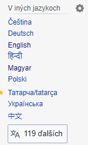

# Multilingvistický slovník

Autor: Viktor Modroczký\
Predmet: Vyhľadávanie informácií

Téma môjho projektu je **Vytvorenie multilingvistického slovníka z wikipédie slovenčina vs. iné jazyky (aspoň 2), vytvoriť spoločný slovník spájajúci jazyky s možnosťou vyhľadávania**.

Projekt bude riešený v jazyku **Java 17** s build nástrojom **Maven**.

## Rámce a knižnice

### Vo verzii 2

**Apache Commons** na spracúvanie CSV súborov.\
**Apache Lucene** na indexovanie.\
**Apache Spark** na distribuované spracovanie.\
**Gson** na spracúvanie JSON súborov.\
**Dotenv-Java** na otváranie `.env` súboru.\
**MySQL Connector Java** na pripojenie k MySQL databáze.

## Vo verzii 1

**Apache Commons** na spracúvanie CSV súborov a reťazcov.\
**Gson** na spracúvanie JSON súborov pre vlastný index.
**Dotenv-Java** na otváranie `.env` súboru.\
**MySQL Connector Java** na pripojenie k MySQL databáze.

## Dataset

[Slovenská Wikipedia](https://dumps.wikimedia.org/skwiki/latest/)\
[Česká Wikipedia](https://dumps.wikimedia.org/cswiki/latest/)\
[Maďarská Wikipedia](https://dumps.wikimedia.org/huwiki/latest/)

## Zámer

Zámerom projektu je vytvorenie viacjazyčného slovníka z dát z Wikipedie, v ktorom bude používateľovi umožnené vyhľadávať.

Na každej Wikipedia stránke je v ľavom paneli sekcia *V iných jazykoch* (obrázok nižšie), ktorá obsahuje prepojenia na články v iných jazykoch. Na tieto prepojenia sa využivajú tzv. Interwiki Links, presnejšie Interlanguage Links (medzijazyčné odkazy).



Medzijazyčné odkazy sú uchovávané v relačnej databáze v tabuľke *langlinks* (bude sa používať tabuľka pre slovenskú Wikipediu). Tabuľka obsahuje 3 stĺpce, a to `ll_from`, `ll_lang` a `ll_title`. Stĺpec `ll_from` je `page_id` odkazujúceho slovenského článku, `ll_lang` je kód jazyka cieľového článku a `ll_title` je názov cieľového článku v jazyku `ll_lang`.

## Verzia 2

V druhej verzii je index vytvorený použitím Apache Lucene. Dáta, ktoré sa indexovali boli distribuovane predspracované pomocou Apache Spark.

Použitie správnych verzií Apache Spark je dôležité pre správne fungovanie distribuovaného spracovania. Boli použité verzie:

[Apache Spark 3.3.1 pre-built for Hadoop](https://www.apache.org/dyn/closer.lua/spark/spark-3.3.1/spark-3.3.1-bin-hadoop3.tgz)

[Apache Hadoop 3.3.1 Windows Bin](https://github.com/kontext-tech/winutils/tree/master/hadoop-3.3.1/bin)

Po stiahnutí binárnych súborov Apache Spark a Apache Hadoop je potrebné nastaviť premenné prostredia nasledovne:

```env
SPARK_HOME=absolute\path\to\spark-3.3.1-bin-hadoop3
HADOOP_HOME=absolute\path\to\hadoop-3.3.1
```

K premennej `PATH` treba potom pridať:

```env
%SPARK_HOME%\bin
%HADOOP_HOME%\bin
```

Dependencies pre Spark **musia** byť nastavené nasledovne, keďže použitá verzia Spark používa Scala 2.12:

```xml
<dependency>
    <groupId>org.apache.spark</groupId>
    <artifactId>spark-core_2.12</artifactId>
    <version>3.3.1</version>
</dependency>
<dependency>
    <groupId>org.apache.spark</groupId>
    <artifactId>spark-sql_2.12</artifactId>
    <version>3.3.1</version>
    <scope>provided</scope>
</dependency>
```

K Java argumentom treba pridať `--add-exports java.base/sun.nio.ch=ALL-UNNAMED`.

Master node sa spúšťa pomocou `spark-class org.apache.spark.deploy.master.Master --host localhost`.

Worker node sa spúšťa pomocou `spark-class org.apache.spark.deploy.worker.Worker spark://localhost:7077`.

Nasledovne je možné spustiť WikiTranslator.

Zoznam príkazov v aplikácii WikiTranslator je (spúšťajú sa ich poradovým číslom):

```txt
1. exit
2. find article ID pairs
3. create sk-cs-hu ID conjunction with Spark
4. create docs with Spark
5. create ID mapping
6. create Lucene index
7. use translation search (use 'exit' for quitting)
```

### Dáta

Zo súborov `skwiki-latest-langlinks.sql.gz`, `cswiki-latest-page.sql.gz` a `huwiki-latest-page.sql.gz` boli SQL súbory importované do lokálnej MySQL databázy, ku ktorej sa aplikácia WikiTranslator pripája použitím prihlasovacích údajov v `.env` súbore v koreňovom adresári projektu. Súbor `.env` musí obsahovať polia:

```env
USER=database_owner
PW=password
```

V `langlinks` tabuľke sa hľadajú odkazy na preklady slovenských článkov tak, že z nej vyberieme hodnoty `ll_title`, ak sa `ll_lang` rovná `cs` alebo `hu`. Hodnota `ll_from` je ID slovenského článku. Podľa `ll_title` potom vyberáme z českej alebo maďarskej tabuľky `page` korešpondujúce ID českého alebo maďarského článku.

Na nájdenie `sk - cs` alebo `sk - hu` párov ID slúži v aplikácii WikiTranslator príkaz `2`. Následne sa pomocou distribuovaného spracovania so Spark dá spustením programu príkazom `3` vytvoriť prienik `sk - cs - hu`.

Ďalším krokom je spracovanie Wikipedia dumpov pomocou nástroja [WikiExtractor](https://github.com/attardi/wikiextractor), ktorý vyčistí XML dump súbory od WikiText syntaxe a zachová články v JSON Lines súboroch so schémou:

```json
{
    "id": "id_value",
    "revid": "revid_value",
    "url": "url_value",
    "title": "title_value",
    "text": "text_value"
}
```

Nástroj treba spustiť v Docker kontajneri pomocou príkazov:

Build: `docker build --pull --rm -t wikiextractor:latest .`

Run: `docker run --rm -it --mount type=bind,source=%cd%\output,target=/wiki/output wikiextractor:latest`

Nástroj sa spúšťa pre každý jazyk zvlášť:

- Pre `sk` jazyk v priečinku `dataset/sk-articles`, kde sa musí nachádzať dump `skwiki-latest-pages-articles.xml.bz2`.
- Pre `cs` jazyk v priečinku `dataset/cs-articles`, kde sa musí nachádzať dump `cswiki-latest-pages-articles.xml.bz2`.
- Pre `hu` jazyk v priečinku `dataset/hu-articles`, kde sa musí nachádzať dump `huwiki-latest-pages-articles.xml.bz2`.

Po dokončení čistenia XML súborov je posledným krokom vytvárania dát na indexovanie vytvorenie samotných dokumentov pre slovenské články a ich české a maďarské preklady. Na to slúži príkaz `4`, ktorým sa dajú vytvoriť `sk`, `cs` a `hu` dokumenty. Dokumenty majú 3 polia, a to `id`, `title` a `text`, ktoré sa pomocou Apache Lucene budú indexovať.

### Indexovanie

Na vytvorenie indexov slúži príkaz `6`. Aplikácia dáva na výber vytvorenie indexov pre `sk`, `cs` a `hu` dokumenty zvlášť. Polia `title` a `text` sa indexujú na vyhľadávanie používateľom zadaného textu. Pole `id` sa indexuje iba na to, aby sme vedeli rýchlo vyhľadať preklady k daným dokumentom.

### Vyhľadávanie

Pred prvým vyhľadávaním treba spustiť príkaz `5`, ktorý vytvorí 3 JSON súbory, a to `sk-map.json`, `cs-map.json` a `hu-map.json`. Tieto súbory slúžia na rýchle zistenie ID prekladov článkov pri vyhľadávaní. Schéma JSON súborov je:

```json
{
    "searched_lang_id": [ "translation_1_id", "translation_2_id" ],
}
```

Syntax vyhľadávača je `lang:at:qtext`, kde:

- `lang` je jazyk, v dokumentoch ktorého chceme vyhľadávať. Može to byť `sk`, `cs` alebo `hu`,
- `at` je pole, v ktorom chceme vyhľadávať. Môže to byť rôzna kombinácia názvov (pole `title` = `T`) a textov (pole `text` = `t`) článkov. Môže to byť `T`, `t`, `T&t`, `t&T`, `T|t` alebo `t|T`. `T`, kde znak `&` znamená 'a zároveň' a znak `|` znamená 'alebo'.
- `qtext` je text, ktorý sa má vyhľadávať v danom jazyku.

Vyhľadávanie vráti zjednodušený výsledok v konzole (výpisy neobsahujú pole `text`) a kompletný výsledok v súbore `output.json` v koreňovom adresári projektu. Vo výstupe sa nachádza top 10 vyhovujúcich výsledkov.

Schéma výsledného JSON súboru je:

```json
{
    "searchResult": [
        {
            "lang1": {
                "id": "id_value",
                "title": "title_value",
                "text": "text_value"
            },
            "lang2": {
                "id": "id_value",
                "title": "title_value",
                "text": "text_value"
            },
            "lang3": {
                "id": "id_value",
                "title": "title_value",
                "text": "text_value"
            }
        },
    ]
}
```

**Príklad:**

Vstup `sk:T&t:covid test` vráti do konzoly výsledok:

```txt
ID Language Title
--------------------------------------
667655 SK Rýchly antigénový test COVID-19
1688511 CS Rychlý antigenní test na covid-19
1773397 HU Covid19-antigén gyorsteszt
--------------------------------------
667137 SK Rýchly antigénový test
1688600 CS Rychlý antigenní test
1774498 HU Antigén gyorsteszt
--------------------------------------
645499 SK COVID-19
1564791 CS Covid-19
1683177 HU Covid19
--------------------------------------
102017 SK Test
242872 CS Testování
11604 HU Test (egyértelműsítő lap)
--------------------------------------
646838 SK Pandémia ochorenia COVID-19
1559185 CS Pandemie covidu-19
1679312 HU Covid19-pandémia
--------------------------------------
905 SK Turingov test
4218 CS Turingův test
182823 HU Turing-teszt
--------------------------------------
444545 SK Kolmogorovov-Smirnovov test
324710 CS Kolmogorovův?Smirnovův test
979361 HU Kolmogorov?Szmirnov-próba
--------------------------------------
339758 SK Klasická teória testov
913998 CS Klasická testová teorie
493883 HU Klasszikus tesztelmélet
--------------------------------------
652542 SK Vakcína proti chorobe COVID-19
1651518 CS Vakcína proti covidu-19
1689580 HU Covid19-vakcina
--------------------------------------
526502 SK Crash Test Dummies
694195 CS Crash Test Dummies
1830033 HU Crash Test Dummies
--------------------------------------
```

Celý výsledok je v súbore [output.json](output.json).

## Verzia 1

V tabuľke *langlinks* budeme vyhľadávať preklady článkov podľa kódov jazykov pomocou stĺpca `ll_lang`. Názvy článkov v slovenčine nájdeme pomocou hodnoty zo stĺpca `ll_from`, a to tak, že v tabuľke *page* pre slovenské články nájdeme `page_title` slovenských názvov podľa hodnôt `page_id`, ktoré zodpovedajú hodnotám `ll_from` v tabuľke *langlinks*. Takto sa budú vyhľadávať názvy rovnakých článkov v 3 rôznych jazykoch - zoberú sa ich názvy a prvé odseky. Prekladač bude vytvorený vo forme vyhľadávača, ktorý bude vracať výsledky na základe zadanej požiadavky. Napr. sa zadá slovo a jazyk, v ktorom sa má dané slovo vyhľadať, a potom sa vrátia všetky dokumenty (názvy článkov) aj s prekladmi do ostatných 2 jazykov, ktoré obsahujú dané slovo.

## Formát dokumentov

Každý dokument má *id* a verziu v slovenčine (*sk*), češtine (*cs*) a maďarčine (*hu*).

```csv
id,sk,cs,hu
1,Fridrich I. Habsburský,Fridrich I. Habsburský,(III.) Frigyes német király
2,Nulové zariadenie,/dev/null,/dev/null
3,0 (číslo),Nula,0 (szám)
4,1 (číslo),1 (číslo),1 (szám)
5,1 euro,1 euro,1 eurós érme
6,"1,2 - dichlóretán","1,2-dichlorethan","1,2-Diklóretán"
7,"1,4-dioxán","1,4-dioxan","1,4-Dioxán"
8,Linka 1 (parížske metro),1 (linka metra v Paříži),1-es metró (Párizs)
9,Prvý česko-slovenský armádny zbor v ZSSR,1. československý armádní sbor,1. Csehszlovák Hadtest
10,1. FC Lokomotive Leipzig (1966),1. FC Lokomotive Leipzig (1966),1. FC Lokomotive Leipzig
```

## Ako funguje vyhľadávanie?

Dokumenty sú indexované pomocou vlastného inverzného indexu pre každý jazyk, ktorý má formát:

`token: ID[]` - každý unikátny token má zoznam článkov, v ktorom sa nachádza.

```json
"stred": [
    "57622",
    "7259",
    "10883"
],
"poseidon": [
    "47671",
    "46947"
],
"palec": [
    "15616"
],
"hebrejcina": [
    "28625",
    "15510"
]
```

Indexy sú pri vytvorení inštancie triedy SearchEngine načítané z JSON súborov do HashMapy, aby bola efektivita vyhľadávania článkov so zhodou O(1).
Pri vyhľadávaní sa vráti zoznam dokumentov, ktoré zodpovedajú dopytu.

### Syntax vyhľadávača

`lang:qtext`, kde:

- `lang` može byť `sk`, `cs` alebo `hu`,
- `qtext` je text, ktorý sa má vyhľadávať v danom jazyku.

Program sa ukončuje príkazom `exit`.

**Príklad:**

`sk: covid test` vráti nasledovný výsledok:

```txt
1. Rýchly antigénový test COVID-19 (sk) = Rychlý antigenní test na covid-19 (cs) = Covid19-antigén gyorsteszt (hu)
2. Rýchly antigénový test (sk) = Rychlý antigenní test (cs) = Antigén gyorsteszt (hu)
3. Turingov test (sk) = Turingův test (cs) = Turing-teszt (hu)
4. Úmrtia na COVID-19 (sk) = Zemřelí na covid-19 (cs) = Covid19-ben elhunyt személyek (hu)
5. Kolmogorovov-Smirnovov test (sk) = Kolmogorovův-Smirnovův test (cs) = Kolmogorov-Szmirnov-próba (hu)
6. Vakcíny proti chorobe COVID-19 (sk) = Vakcíny proti covidu-19 (cs) = Covid19-védőoltások (hu)
7. Pandémia ochorenia COVID-19 (sk) = Pandemie covidu-19 (cs) = Covid19-koronavírus-járvány (hu)
8. Test (sk) = Testování (cs) = Test (egyértelműsítő lap) (hu)
9. Dáta pandémie ochorenia COVID-19 (sk) = Data pandemie covidu-19 (cs) = Covid19-pandémia adatai (hu)
10. COVID-19 (sk) = Covid-19 (cs) = Covid19 (hu)
11. COVID-19 (sk) = Covid-19 (cs) = Covid19 (hu)
12. Exploration Flight Test-1 (sk) = Exploration Flight Test 1 (cs) = Exploration Flight Test 1 (hu)
13. Vakcína proti chorobe COVID-19 (sk) = Vakcína proti covidu-19 (cs) = Covid19-vakcina (hu)
14. Pandémia ochorenia COVID-19 (sk) = Pandemie covidu-19 (cs) = Covid19-pandémia (hu)
```

Vidíme, že na prvom mieste je výsledok, ktorý v slovenčine obsahuje slová *covid* aj *test*, keďže je najrelevantnejší.
Ďalšie výsledky obsahujú iba jedno zo slov.
